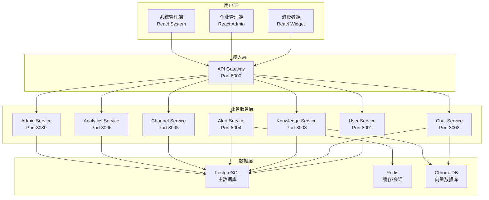
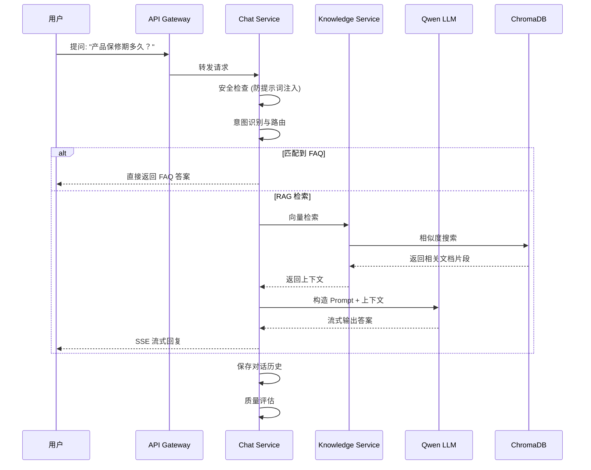

# RAG 智能客服系统 - 产品经理视角项目整合说明

---

## 📋 文档概述

本文档从产品经理的视角，全面介绍 RAG 智能客服系统的产品定位、功能架构、技术实现和部署方案，帮助团队成员理解整个项目的业务价值和技术全貌。

**目标读者**：产品经理、项目经理、技术负责人、业务运营

**版本**：v2.0.0  
**最后更新**：2026-05-18

---

## 🏗️ 一、产品全景图

### 1.1 产品定位

RAG 智能客服系统是一套**企业级多租户智能客服解决方案**，具有以下核心特点：

| 特性 | 说明 |
|------|------|
| **技术驱动** | 基于 LLM + RAG 技术，提供智能问答能力 |
| **多租户 SaaS** | 支持多企业同时使用，数据完全隔离 |
| **多渠道接入** | 支持 Web Widget、微信公众号、钉钉、飞书等 |
| **微服务架构** | 后端服务模块化，支持灵活扩展 |
| **前后端完全分离** | 三个独立前端，通过 API 网关统一接入 |

### 1.2 产品愿景

> 让每一个企业都能轻松拥有自己的 AI 智能客服，用数据驱动服务效率提升。

### 1.3 产品价值

- **降低人工成本**：AI 自动处理 70%+ 的常见问题
- **提升响应速度**：7x24 小时在线，秒级回复
- **知识沉淀复用**：企业知识自动存储、检索、复用
- **数据驱动运营**：完整的数据分析和运营报表

---

## 👥 二、目标用户画像

### 2.1 用户角色

| 角色 | 职责 | 核心需求 |
|------|------|---------|
| **终端消费者** | 使用客服的用户 | 问题快速解决、体验流畅 |
| **企业运营人员** | 管理客服系统 | 知识库维护、对话监控、数据分析 |
| **系统管理员** | 平台运维 | 租户管理、服务监控、配置管理 |

### 2.2 用户场景

#### 场景一：电商客服问答
> **用户**："请问这款产品的保修期是多久？"  
> **AI**："根据《产品手册》P.15，本产品保修期为一年。如果您需要保修服务，请...（来源：知识库文档）"

#### 场景二：企业知识库管理
> **运营人员**：上传 10 份产品文档 → AI 自动解析、向量化存储 → 用户提问时精准检索

#### 场景三：敏感内容监控
> **系统**：检测到用户询问"退款政策"（敏感内容） → 自动转人工客服介入

---

## 🔍 三、核心功能矩阵

### 3.1 前端三端功能

| 模块 | 功能 | 消费者端 | 企业端 | 系统管理端 |
|------|------|---------|--------|-----------|
| **用户认证** | 登录/注册 | ✅ | ✅ | ✅ |
| **对话功能** | 智能问答 | ✅ | ✅ | ❌ |
| | 会话历史 | ✅ | ✅ | ❌ |
| | 流式输出 | ✅ | ✅ | ❌ |
| **知识库** | 文档管理 | ❌ | ✅ | ✅ |
| | 知识库配置 | ❌ | ✅ | ✅ |
| | FAQ 管理 | ❌ | ✅ | ✅ |
| **渠道接入** | Web Widget | ❌ | ✅ | ✅ |
| | 微信公众号 | ❌ | ✅ | ✅ |
| | 钉钉/飞书 | ❌ | ✅ | ✅ |
| **运营管理** | 对话监控 | ❌ | ✅ | ✅ |
| | 告警中心 | ❌ | ✅ | ✅ |
| | 数据分析 | ❌ | ✅ | ✅ |
| **系统配置** | API 配置 | ❌ | ❌ | ✅ |
| | 租户管理 | ❌ | ❌ | ✅ |
| | 服务监控 | ❌ | ❌ | ✅ |

### 3.2 后端微服务能力

| 服务 | 核心能力 | 技术栈 |
|------|---------|--------|
| **API Gateway** | 统一入口、安全认证、路由转发 | FastAPI + Redis |
| **User Service** | 用户、企业、权限、敏感词管理 | FastAPI + PostgreSQL |
| **Chat Service** | 对话、意图路由、RAG 检索、流式输出 | FastAPI + Qwen + ChromaDB |
| **Knowledge Service** | 文档上传、解析、向量化、检索 | FastAPI + ChromaDB |
| **Channel Service** | 多渠道消息接入与转发 | FastAPI + Webhook |
| **Alert Service** | 告警规则、通知推送 | FastAPI + Redis PubSub |
| **Analytics Service** | 数据统计、分析报表 | FastAPI + SQL |
| **Admin Service** | 管理后台 API | FastAPI |

---

## 🏛️ 四、技术架构全景

### 4.1 整体架构图



### 4.2 技术栈详解

#### 前端技术（最新）

```json
{
  "架构模式": "Monorepo + 工作区",
  "核心框架": "React 18 + TypeScript",
  "状态管理": "Zustand",
  "UI 框架": "Tailwind CSS + 自建组件库",
  "构建工具": "Vite",
  "特色": {
    "流式输出": "SSE (Server-Sent Events)",
    "组件共享": "@rag/ui 共享组件库",
    "状态共享": "@rag/store 共享状态",
    "API 配置": "动态 API 配置，前后端完全分离"
  }
}
```

#### 后端技术

```json
{
  "架构模式": "微服务 + API 网关",
  "Web 框架": "FastAPI",
  "数据库": "PostgreSQL + SQLAlchemy",
  "向量数据库": "ChromaDB",
  "缓存": "Redis",
  "LLM 集成": "通义千问 (Qwen)",
  "部署": "Docker + Docker Compose"
}
```

### 4.3 项目结构

```
/workspace/
├── backend/                    # 后端微服务
│   ├── api-gateway/           # API 网关
│   ├── user-service/          # 用户服务
│   ├── chat-service/          # 聊天服务
│   ├── knowledge-service/     # 知识库服务
│   ├── channel-service/       # 渠道服务
│   ├── alert-service/         # 告警服务
│   ├── analytics-service/     # 分析服务
│   ├── admin-service/         # 管理服务
│   └── common/                # 公共模块
│
├── frontend/                  # 前端项目 (Monorepo)
│   ├── apps/
│   │   ├── consumer/          # 消费者端 (React + TS)
│   │   ├── enterprise/        # 企业端 (React + TS)
│   │   └── system-admin/      # 系统管理端 (React + TS)
│   └── packages/
│       ├── ui/                # 共享组件库
│       └── store/             # 共享状态库
│
├── docker-compose.yml         # Docker 编排
└── docs/                      # 文档
```

---

## 🔄 五、核心业务流程

### 5.1 RAG 问答流程



### 5.2 知识库文档处理流程

```
上传文档 → 文本解析 → 分块 (Chunking) → 向量化 (Embedding)
                                        ↓
                              存储到 ChromaDB + PostgreSQL
```

支持格式：PDF、TXT、DOCX、Markdown

---

## 📊 六、数据模型（业务视角）

### 6.1 核心业务实体

| 实体 | 说明 | 关键字段 |
|------|------|---------|
| **企业 (Enterprise)** | 租户单位 | id, name, api_key, settings |
| **用户 (User)** | 系统用户 | id, username, email, role, enterprise_id |
| **知识库 (Knowledge Base)** | 文档集合 | id, name, enterprise_id, description |
| **文档 (Document)** | 单个文件 | id, filename, kb_id, status, chunk_count |
| **会话 (Chat Session)** | 对话上下文 | id, user_id, enterprise_id, title |
| **消息 (Message)** | 单条消息 | id, session_id, role, content, sources |
| **敏感词设置 (Sensitive Settings)** | 安全规则 | enable_detection, keywords, rules |

### 6.2 多租户数据隔离策略

```
PostgreSQL Schema 隔离:
  ├─ tenant_001/
  │   ├─ users
  │   ├─ documents
  │   └─ ...
  └─ tenant_002/
      ├─ users
      ├─ documents
      └─ ...

ChromaDB Collection 隔离:
  ├─ enterprise_001_kb_1
  ├─ enterprise_001_kb_2
  └─ enterprise_002_kb_1
```

---

## 🚀 七、部署与运维

### 7.1 快速启动

```bash
# 1. 配置环境变量
cp .env.example .env
# 编辑 .env: DB_PASSWORD, OPENAI_API_KEY, QWEN_API_KEY

# 2. 启动所有服务
docker-compose up -d

# 3. 访问服务
# 消费者端: http://localhost:3000
# 企业端: http://localhost:8080
# 系统管理端: http://localhost:9090
# API 文档: http://localhost:8000/docs
```

### 7.2 端口分配

| 服务 | 端口 | 说明 |
|------|------|------|
| API Gateway | 8000 | 统一 API 入口 |
| User Service | 8001 | 用户管理 |
| Chat Service | 8002 | 对话服务 |
| Knowledge Service | 8003 | 知识库服务 |
| Channel Service | 8005 | 渠道服务 |
| Admin Service | 8080 | 管理后台 API |
| PostgreSQL | 5432 | 数据库 |
| Redis | 6379 | 缓存 |
| ChromaDB | 8007 | 向量数据库 |

---

## 📈 八、产品成功指标

### 8.1 核心业务指标（KPIs）

| 指标 | 目标值 | 计算方式 |
|------|--------|---------|
| **对话解决率** | > 85% | 无需转人工的对话数 / 总对话数 |
| **FAQ 命中率** | > 30% | FAQ 直接回答数 / 总对话数 |
| **平均响应时间** | < 2 秒 | 从提问到首字输出的时间 |
| **用户满意度** | > 4.5/5.0 | 点赞率 / (点赞 + 点踩) |
| **知识库覆盖率** | > 90% | 有文档回答的问题数 / 总问题数 |

### 8.2 技术指标

| 指标 | 目标值 |
|------|--------|
| 系统可用性 | > 99.5% |
| API 响应时间 (P95) | < 500ms |
| 并发支持 | > 500 QPS |

---

## 🔮 九、产品发展路线图

### 第一阶段：已完成 ✅
- ✅ 微服务架构搭建
- ✅ 前后端完全分离（React 重构）
- ✅ RAG 问答 + 流式输出
- ✅ 知识库管理
- ✅ API 配置功能（前后端完全解耦）

### 第二阶段：进行中 🔄
- 🔄 多模态文档解析（图片 OCR、PDF 表格）
- 🔄 增强意图路由与成本优化
- 🔄 会话存档与导出

### 第三阶段：规划中 📋
- 📋 多语言支持
- 📋 智能知识库自动优化
- 📋 AI 辅助知识库生成
- 📋 客服机器人训练平台

---

## 📝 十、关键设计决策记录

### 10.1 前后端技术选型

| 决策 | 原因 | 替代方案 |
|------|------|---------|
| **React + TypeScript** | 类型安全、生态成熟、开发效率高 | Vue 3 / Angular |
| **Monorepo** | 组件和状态共享、统一依赖管理 | 多仓库 |
| **Tailwind CSS** | 原子化 CSS、开发快速、样式一致性 | SCSS + 组件库 |
| **FastAPI** | 异步高性能、自动 API 文档、类型安全 | Flask / Django |

### 10.2 架构决策

| 决策 | 原因 |
|------|------|
| **微服务架构** | 独立部署、灵活扩展、团队并行开发 |
| **API Gateway** | 统一入口、安全认证、路由转发、限流 |
| **前后端完全分离** | 独立演进、API 可复用、多端适配 |
| **动态 API 配置** | 支持灵活切换后端地址、便于部署 |

---

## 🔗 十一、相关文档索引

| 文档 | 链接 | 说明 |
|------|------|------|
| 部署指南 | [DEPLOYMENT_GUIDE.md](./DEPLOYMENT_GUIDE.md) | 完整部署步骤 |
| 架构设计 | [ARCHITECTURE_FINAL.md](./ARCHITECTURE_FINAL.md) | 技术架构详情 |
| API 规范 | [API_SPECIFICATION.md](./API_SPECIFICATION.md) | 接口文档 |
| 功能路线图 | [feature_roadmap.md](./feature_roadmap.md) | 产品迭代计划 |
| 学习指南 | [LEARNING_GUIDE.md](./LEARNING_GUIDE.md) | 新手入门教程 |

---

## 👥 十二、团队协作指南

### 12.1 开发流程

```
需求讨论 → 设计评审 → 开发实现 → 联调测试 → 上线发布
   ↓          ↓          ↓          ↓          ↓
  PRD       技术方案    前后端分离    端到端测试   灰度发布
```

### 12.2 协作工具建议

| 用途 | 推荐工具 |
|------|---------|
| 需求管理 | Jira / Notion |
| 设计原型 | Figma |
| 代码管理 | GitHub / GitLab |
| CI/CD | GitHub Actions / GitLab CI |
| 监控告警 | Prometheus + Grafana |

---

## 📞 十三、联系我们

如有问题或建议，请联系：
- **产品团队**：product@example.com
- **技术团队**：tech@example.com
- **项目仓库**：https://github.com/your-org/rag-customer-service

---

*本文档持续更新中...*
*最后更新：2026-05-18*
